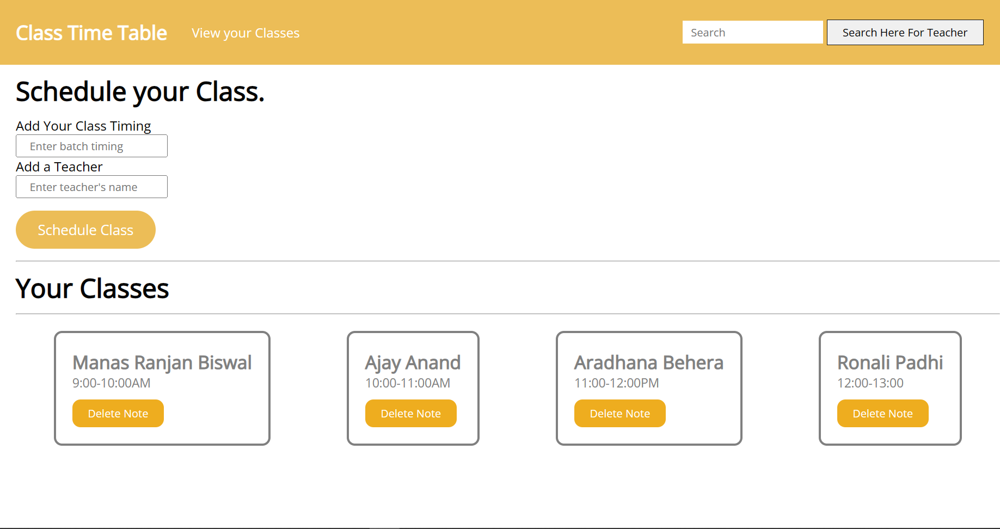

## <a href="https://sanchariii.github.io/Time-Table-Wizard/" target="_blank">Welcome to the Classroom Website</a> 👩‍🏫

A website that lets you write about all your classes at one place. You can also search by typing the name of the teacher if you have so many classes to take.

# Used Technologies
<ul>
  <li>HTML5</li>
  <li>CSS3</li>
  <li>JavaScript</li>
</ul>

# Purpose of this Project 

 This project is helpful to students managing their classes, the student can schedule their batch and its timing here. Its easier for students to have all the classes at one place rather searching for which class to attend now. 🏫

#### Steps to Use:
---

- Download or clone the repository
- Go to the directory
- Run the index.html file
- Schedule your new class.
- Add more and more classes.

<h4> Demo picture </h4>  

If you want to add any features on this project do let me know!!

